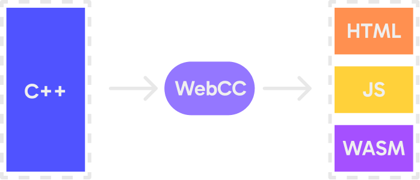
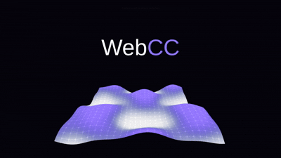

<p align="center">
  
</p>

# WebCC

[](https://github.com/io-eric/webcc/actions/workflows/ci.yml)
[](https://opensource.org/licenses/MIT)
[](http://makeapullrequest.com)

**WebCC** is a lightweight, zero-dependency C++ toolchain and framework for building WebAssembly applications. It provides a direct, high-performance bridge between C++ and HTML5 APIs (DOM, Canvas, WebGL, WebGPU, Audio, ...).

<p align="center">
  
</p>

## Features

- Generates minimal WASM binaries and glue code.
- No heavy runtimes or external libraries required.
- Uses a binary command buffer to batch API calls, minimizing C++/JS boundary overhead.
- Supports DOM, Canvas 2D, WebGL, WebGPU, Audio, Input, WebSockets, and more.
- A single CLI tool handles code generation and compilation.
- Incremental compilation using `.webcc_cache` for faster rebuilds.
- Easily extensible API: generates headers and glue code based on a schema definition.

## Documentation

Full documentation is available in the [docs/](docs/index.md) directory.
- [**Getting Started Guide**](docs/getting_started.md): A step-by-step tutorial for your first project.
- [**API Reference**](docs/index.md#api-reference): Detailed documentation for all modules.
- [**Architecture**](docs/architecture.md): Deep dive into how WebCC works.

## Quick Start

### Example

Here is a complete example of creating a Canvas, handling mouse input, and running a loop:

```cpp
#include "webcc/canvas.h"
#include "webcc/dom.h"
#include "webcc/system.h"
#include "webcc/input.h"

// Global handles
webcc::handle canvas;
webcc::handle ctx;
int mouse_x = 400.0f;
int mouse_y = 300.0f;

// Main loop function called every frame
void update(float time_ms) {
    // Poll events
    uint8_t opcode;
    const uint8_t* data;
    uint32_t len;
    while (webcc::poll_event(opcode, &data, len)) {
        if (opcode == webcc::input::EVENT_MOUSE_MOVE) {
            // Parse event data safely
            auto event = webcc::parse_event<webcc::input::MouseMoveEvent>(data, len);
            mouse_x = event.x;
            mouse_y = event.y;
        }
    }

    // Clear background (Blue)
    webcc::canvas::set_fill_style(ctx, 52, 152, 219);
    webcc::canvas::fill_rect(ctx, 0, 0, 800, 600);

    // Draw circle at mouse position (Yellow)
    webcc::canvas::begin_path(ctx);
    webcc::canvas::arc(ctx, mouse_x, mouse_y, 50, 0, 6.28318f);
    webcc::canvas::set_fill_style(ctx, 241, 196, 15);
    webcc::canvas::fill(ctx);

    // Draw text
    webcc::canvas::set_font(ctx, "30px Arial");
    webcc::canvas::set_fill_style(ctx, 255, 255, 255);
    webcc::canvas::fill_text(ctx, "Move your mouse!", 280, 500);

    // Flush commands to JS
    webcc::flush();
}

int main() {
    // Setup DOM
    webcc::handle body = webcc::dom::get_body();
    canvas = webcc::canvas::create_canvas("game-canvas", 800, 600);
    webcc::dom::append_child(body, canvas);
    
    // Get Context
    ctx = webcc::canvas::get_context(canvas, "2d");
    
    // Initialize mouse input on the canvas
    webcc::input::init_mouse(canvas);

    // Start the main loop
    webcc::system::set_main_loop(update);
    
    // Flush commands to JS
    webcc::flush();
    
    return 0;
}
```

### Building & Running

1.  **Build the toolchain** (first time only):
    Bootstraps the `webcc` compiler. This script compiles a bootstrap version of the tool, generates the API headers from the schema, and then compiles the final `webcc` binary with the schema embedded.
    ```bash
    ./build.sh
    ```

2.  **Compile your app**:
    ```bash
    ./webcc main.cc
    ```

3.  **Run**:
    ```bash
    python3 -m http.server
    ```
    Open [http://localhost:8000](http://localhost:8000).

## Installation

1.  **Clone the repository:**
    ```bash
    git clone https://github.com/io-eric/webcc.git
    cd webcc
    ```

2.  **Prerequisites**:
    - Linux, macOS, or Windows (via WSL) with Bash.
    - `clang++` (version 8+ recommended) for compiling WASM.
    - A C++20 compiler for building the CLI tool.

## CLI Reference

The `webcc` tool is your primary interface for the framework.

### 1. Generate Headers
Generates the C++ header files in `include/webcc/` from `schema.def`.
> **Note**: This is used internally by `build.sh`. If you modify `schema.def`, you should run `./build.sh` to rebuild the tool so that the embedded schema matches your changes.
```bash
./webcc --headers [schema.def]
```

### 2. Compile Application
Compiles your C++ source files into `app.wasm`, and generates the optimized `app.js` and `index.html`.
Use the `--out <dir>` flag to specify the output directory (defaults to the current directory).
```bash
./webcc main.cc [other_sources.cc ...] [--out dist]
```

## Examples

**[View Live Demos](https://io-eric.github.io/webcc/)**

Check the `examples/` directory for complete demos.

### 1. Canvas 2D (`webcc_canvas`)
Interactive 2D graphics with mouse tracking.


### 2. WebGL 3D (`webcc_webgl`)
A rotating 3D cube using raw WebGL calls.


### 3. WebGL Waves (`webcc_webgl_waves`)
Animated wave terrain using WebGL shaders.



### 4. WebGPU (`webcc_webgpu`)
A triangle rendered using the WebGPU API.

### 5. DOM Manipulation (`webcc_dom`)
Creating and styling HTML elements from C++.


## Contributing ✅

- **Contributions welcome.** If you'd like to add a command, update `schema.def` following the file format and run `./build.sh` to regenerate the toolchain.
- **Small PRs are best.** Include a short example (or a unit test) demonstrating the new API and a brief description in the PR.
- **Tips:** Prefer returning integer handles for created resources (use `RET:int32`), register DOM/audio/image objects in the `elements` map when appropriate, and ensure your JS implementation is robust (checks for missing handles, etc.).
****

## Modules

- **`webcc/dom.h`**: DOM manipulation (create, append, remove, attributes).
- **`webcc/canvas.h`**: HTML5 Canvas 2D context.
- **`webcc/webgl.h`**: WebGL context.
- **`webcc/wgpu.h`**: WebGPU context.
- **`webcc/audio.h`**: Audio playback and control.
- **`webcc/input.h`**: Mouse and keyboard input.
- **`webcc/system.h`**: System utilities.
- **`webcc/websocket.h`**: WebSocket communication.
- **`webcc/storage.h`**: Local storage.
- **`webcc/image.h`**: Image loading.

## License

[MIT](LICENSE)
