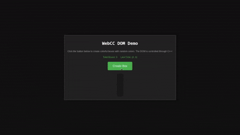

# WebCC

**WebCC** is a lightweight, zero-dependency C++ framework for building WebAssembly applications. It provides a direct, high-performance bridge between C++ and HTML5 APIs (DOM, Canvas, WebGL, Audio, ...) without the overhead of heavy runtimes like Emscripten.

## Features

- **🚀 Lightweight**: Generates minimal WASM binaries and glue code.
- **⚡ Fast**: Uses a binary command buffer to batch API calls, minimizing the C++/JS boundary overhead.
- **🛠️ Simple Toolchain**: A single CLI tool (`webcc`) handles code generation, HTML scaffolding, and compilation.
- **🌐 Web APIs**: First-class support for:
  - **DOM**: Create and manipulate HTML elements.
  - **Canvas 2D**: High-performance 2D rendering.
  - **WebGL**: Direct access to WebGL for 3D graphics.
  - **Audio**: Play sounds and control audio playback.
  - **Input**: Handle keyboard and mouse events.
  - **WebSockets**: Real-time network communication.
  - **Storage**: Local storage and session storage.
  - **Image**: Load and draw images.
  - **System**: Logging, main loop, and window management.

## Prerequisites

- **C++ Compiler**: `g++` or `clang++` with **C++17** support (required to build the CLI tool itself).
- **Clang for WASM**: `clang++` (specifically `clang` version 8+ is recommended) is used **under the hood** to compile your code to WebAssembly.
- **Environment**: Linux/macOS with Bash.

## Installation

1. **Clone the repository:**
   ```bash
   git clone https://github.com/io-eric/webcc.git
   cd webcc
   ```

2. **Build the CLI tool:**
   ```bash
   ./build.sh
   ```
   This will compile the `webcc` binary in the `webcc/` directory.

## Usage

1. **Create a C++ file** (e.g., `main.cc`):

   ```cpp
   #include "webcc/canvas.h"
   #include "webcc/dom.h"
   #include "webcc/system.h"

   int main() {
       // Create a canvas element (800x600)
       webcc::canvas::create_canvas("game-canvas", 800, 600);
       webcc::dom::append_child("body", "game-canvas");

       // Draw a blue background
       webcc::canvas::set_fill_style("game-canvas", 52, 152, 219); // RGB
       webcc::canvas::fill_rect("game-canvas", 0, 0, 800, 600);

       // Draw a yellow circle in the center
       webcc::canvas::begin_path("game-canvas");
       webcc::canvas::arc("game-canvas", 400, 300, 50, 0, 6.28318f);
       webcc::canvas::set_fill_style("game-canvas", 241, 196, 15);
       webcc::canvas::fill("game-canvas");

       // Draw some text
       webcc::canvas::set_font("game-canvas", "30px Arial");
       webcc::canvas::set_fill_style("game-canvas", 255, 255, 255);
       webcc::canvas::fill_text("game-canvas", "Hello WebCC!", 310, 500);

       // Flush commands to JS
       webcc::flush();
       
       return 0;
   }
   ```

2. **Compile your application:**
   Run the `webcc` tool (ensure you have built it first!) from the root of the repository, passing your source file:

   ```bash
   ./webcc/webcc main.cc
   ```

   This will generate:
   - `app.wasm`: Your compiled WebAssembly code.
   - `app.js`: The generated JavaScript runtime and bindings.
   - `index.html`: A basic HTML entry point.

3. **Run it:**
   You need a local web server to serve WASM files correctly.

   ```bash
   python3 -m http.server
   ```
   Open [http://localhost:8000](http://localhost:8000) in your browser.

## Architecture

WebCC works by serializing API calls into a linear memory buffer. When you call a function like `webcc::dom::create_element`, it writes an opcode and arguments to this buffer.

When `webcc::flush()` is called, the buffer is passed to the JavaScript runtime, which decodes the commands and executes the corresponding Web APIs. This batching approach significantly reduces the performance penalty of calling back and forth between WebAssembly and JavaScript.

## Modules

- **`webcc/dom.h`**: DOM manipulation (create, append, remove, attributes, innerHTML).
- **`webcc/canvas.h`**: HTML5 Canvas 2D context (shapes, text, images, transforms).
- **`webcc/webgl.h`**: WebGL context (shaders, buffers, drawing).
- **`webcc/audio.h`**: Audio playback and control.
- **`webcc/input.h`**: Mouse and keyboard input handling.
- **`webcc/system.h`**: System utilities (logging, main loop, title).

## Examples

Check the `examples/` directory for complete demos.

### 1. Canvas 2D (`webcc_canvas`)
Interactive 2D graphics with mouse tracking.


### 2. WebGL 3D (`webcc_webgl`)
A rotating 3D cube using raw WebGL calls.


### 3. DOM Manipulation (`webcc_dom`)
Creating and styling HTML elements from C++.



To build an example:
```bash
./webcc/webcc examples/webcc_canvas/example.cc
```

## Documentation

Currently, the best way to learn WebCC is to explore the header files and examples:

- **API Definitions**: `webcc/commands.def` contains the raw definitions of all supported JS operations.
- **Headers**: `webcc/include/webcc/*.h` show the C++ API signatures.
- **Examples**: `examples/` contains working demos for DOM, Canvas, WebGL, and Audio.

## Project Structure

- `webcc/`: Source code for the CLI tool and runtime.
  - `cli/`: Entry point for the CLI.
  - `src/`: Implementation of the generator and command buffer.
  - `include/`: Public headers (`webcc.h`, etc.).
- `examples/`: Example projects demonstrating different features.
- `commands.def`: Definition file for all supported Web API commands.

## License

[MIT](LICENSE)
